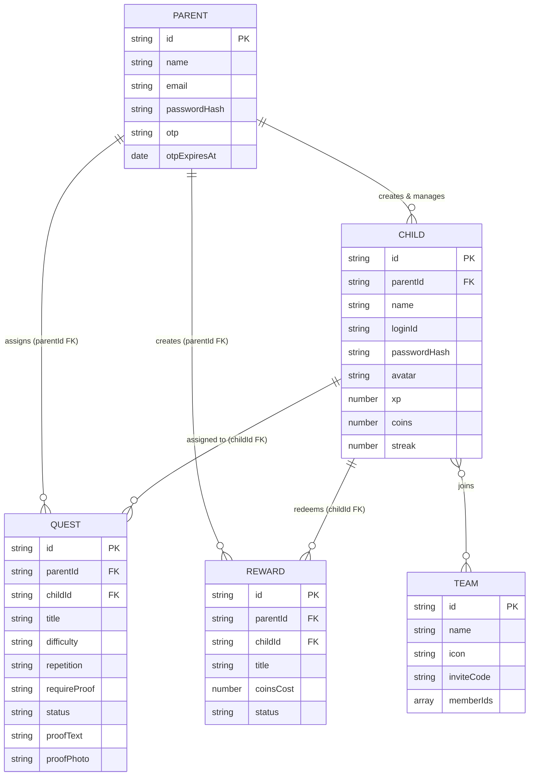
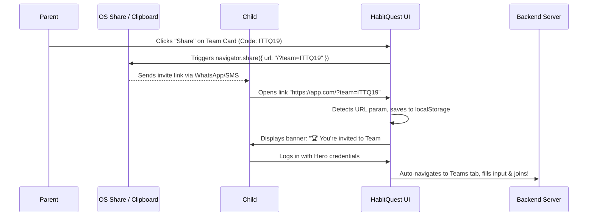

# 🏰 HabitQuest: Complete Step-by-Step Project Documentation

> [!IMPORTANT]
> This document provides a complete technical and architectural overview of **HabitQuest**—an interactive, gamified RPG habit-tracking platform designed for parents and children. It details the step-by-step development history, AI prototyping workflow (Google AI Studio & Flowstep AI), technology stack, database architecture (featuring universal `parentId` relational binding across Children, Quests, and Rewards), third-party service integrations, and serverless performance optimizations.

---

## 📑 Table of Contents
1. [Project Overview & Design Philosophy](#1-project-overview--design-philosophy)
2. [Complete Technology Stack](#2-complete-technology-stack)
3. [Database Architecture & Schema Structure](#3-database-architecture--schema-structure)
4. [Step-by-Step Feature Construction](#4-step-by-step-feature-construction)
   - [Phase 0: Ideation, Prototyping & Architectural Scaffolding](#phase-0-ideation-prototyping--architectural-scaffolding)
   - [Phase 1: Core Foundation & RPG Gamification Loop](#phase-1-core-foundation--rpg-gamification-loop)
   - [Phase 2: Authentication & EmailJS OTP Verification](#phase-2-authentication--emailjs-otp-verification)
   - [Phase 3: The Hero Portal & Proof Verification System](#phase-3-the-hero-portal--proof-verification-system)
   - [Phase 4: Rewards Store & Economy](#phase-4-rewards-store--economy)
   - [Phase 5: Teams, Leaderboards & Viral Share Flow](#phase-5-teams-leaderboards--viral-share-flow)
   - [Phase 6: AI Habit Planner & Parenting Assistant](#phase-6-ai-habit-planner--parenting-assistant)
   - [Phase 7: Serverless Scaling & Connection Pooling](#phase-7-serverless-scaling--connection-pooling)
5. [Deployment Architecture (Vercel Serverless)](#5-deployment-architecture-vercel-serverless)
6. [API Endpoints Reference](#6-api-endpoints-reference)

---

## 1. Project Overview & Design Philosophy

Traditional habit trackers often fail with children due to a lack of immediate engagement and rigid interfaces. **HabitQuest** solves this by transforming daily chores, homework, and routines into an exciting RPG adventure.

### 🌟 Key Pillars:
- **Gamified Engagement**: Children act as **Heroes** (Knights, Wizards, Ninjas, Rangers, or Unicorns), completing daily **Quests** (chores) to earn **XP** (experience points), **Coins** (reward currency), and **Streaks**.
- **Parental Guidance & Verification**: Parents act as **Game Masters**, assigning tasks with specific repetition rules, difficulty tiers, and proof requirements (none, text notes, or webcam/photo uploads). To maintain absolute data security and family separation, every single created entity (Children, Quests, and Rewards) is bound directly to the Game Master via a persistent `parentId` foreign key.
- **Vibrant & Responsive UI**: Built with modern aesthetics—glassmorphism, vibrant gradients, micro-animations, and interactive canvas confetti rewards.
- **AI-Powered Assistance**: Integrated with generative AI (initially built with **Google Gemini SDK**, currently running via **OpenRouter API**) to help parents generate age-appropriate routine schedules and receive actionable parenting advice.

### 💡 Ideation, Prototyping & UI Workflow:
- **Architectural & Schema Modeling (Google AI Studio)**: Before writing production code, the foundational logic structure, relational schemas (including the universal `parentId` binding across all family entities), and gamification loops were prototyped and refined using **Google AI Studio**.
- **Static UI Reference Generation (Flowstep AI)**: The initial user interface layout, visual hierarchy, and component design were generated as a static UI mockup using **Flowstep AI**. This static prototype served as the visual blueprint and core design reference for building out the responsive React 19 + TypeScript frontend application.

---

## 2. Complete Technology Stack

The application is engineered as a full-stack TypeScript application optimized for serverless execution.

| Layer | Technology / Library | Purpose in Project |
| :--- | :--- | :--- |
| **Prototyping & Structure** | **Google AI Studio** | Used for initial architectural scaffolding, system modeling, relational schema conceptualization (`parentId` binding), and prompt engineering. |
| **UI Reference Generator** | **Flowstep AI** | Used to generate static visual UI prototypes that served as the primary design reference for the React interface. |
| **Frontend Framework** | **React 19 + TypeScript** | Core UI library providing reactive state management and type-safe component architecture. |
| **Build Tool & Routing** | **Vite** | Ultra-fast local development server and optimized production bundle compilation. |
| **Styling & UI Design** | **Vanilla CSS + Utility Tokens** | Custom modern utility classes, glassmorphism effects, gradient cards, and smooth CSS keyframe animations based on Flowstep AI designs. |
| **Icons & Micro-interactions** | **Lucide React + Canvas-Confetti** | Crisp, scalable SVG iconography and celebratory interactive confetti fireworks upon task completion. |
| **Backend API** | **Express.js (v5) + Node.js** | RESTful API server handling authentication, CRUD operations, verification workflows, and AI prompting. |
| **Security & Auth** | **JSON Web Tokens (JWT) + Bcryptjs** | Stateless token-based authentication (`30d` expiry) and secure `saltRound=10` password hashing. |
| **Database Engine** | **MongoDB Atlas + Official Node Driver** | Cloud NoSQL database utilizing a custom connection-pooled caching engine (`DBEngine`) indexed by `parentId`. |
| **Email Service** | **EmailJS REST API** | Transactional email delivery for OTP verification codes during registration and password reset flows. |
| **AI Integration** | **OpenRouter API (initially Google Gemini)** | Generative AI integration powering the *AI Habit Planner* and *Parent Assistant* chat tools, utilizing OpenRouter for flexible multi-model access. |
| **Cloud Hosting** | **Vercel Serverless Functions** | Seamless deployment hosting static frontend assets and routing `/api/*` requests to serverless containers. |

---

## 3. Database Architecture & Schema Structure

HabitQuest utilizes MongoDB Atlas. To ensure high speed and reliability in serverless environments, data is structured around an **Application State Document (`app_state`)** supplemented by individual synced collections.

A critical design decision modeled during the initial **Google AI Studio** prototyping phase was the **Universal Game Master Binding**: the `parentId` foreign key is explicitly attached not only to `CHILD`, but also directly to every `QUEST` and `REWARD`. This guarantees that parents retain direct ownership and querying capabilities over all items in their family ecosystem without requiring deep nested joins.



### 🗄️ Detailed Collection Breakdown:

1. **`parents`**: Stores account credentials, family names, and authentication states.
   - **Security**: Passwords are never stored in plain text; they are hashed via `bcrypt.hash()`.
   - **OTP Verification**: Contains temporary fields `otp` (6-digit numeric string) and `otpExpiresAt` (timestamp set to +15 minutes) during registration and password reset attempts.
2. **`children`**: Represents Hero profiles linked to a parent account via `parentId`.
   - **Authentication**: Children log in using a simple, easy-to-remember `loginId` (e.g., `hero_alex`) and a PIN/password.
   - **Gamification Stats**: Tracks cumulative `xp`, spendable `coins`, and daily completion `streak`.
3. **`quests`**: Represents tasks assigned to a child hero.
   - **Universal Binding**: Connected directly to both the assigning Game Master (`parentId`) and the target Hero (`childId`). Having `parentId` directly on the quest allows parent dashboards to fetch all household chores in a single blazing-fast query.
   - **Attributes**: Includes `difficulty` (`easy` = 10 XP/10 Coins, `medium` = 20 XP/20 Coins, `hard` = 40 XP/40 Coins), `repetition` (`daily`, `weekly`, or `once`), and `requireProof` (`none`, `text`, or `photo`).
   - **Lifecycle Statuses**:
     - `pending`: Waiting for the child to complete.
     - `completed`: Submitted by child (with proof if required), waiting for parent verification.
     - `verified`: Approved by parent; XP and coins have been awarded.
4. **`rewards`**: Represents custom store items created by parents (e.g., "Sleepover", "Ice Cream Trip", "30 mins Gaming").
   - **Universal Binding**: Connected directly to both the creating Game Master (`parentId`) and the redeeming Hero (`childId`).
   - **Lifecycle Statuses**: `available` (can be purchased), `requested` (child spent coins, waiting for approval), `approved` (parent granted reward).
5. **`teams`**: Represents collaborative hero groups.
   - **Invite Code**: A unique 6-character alphanumeric identifier (e.g., `ITTQ19`) generated upon team creation.

---

## 4. Step-by-Step Feature Construction

### Phase 0: Ideation, Prototyping & Architectural Scaffolding
- **Objective**: Establish the project blueprint, data structures, and visual identity before writing production code.
- **Implementation**:
  - **Logic & Schema Modeling via Google AI Studio**: Used Google AI Studio to conceptualize the gamified RPG data structure. During this phase, we established the rule that `parentId` must be present on Quests and Rewards as well as Children to ensure seamless family data isolation. We also modeled the AI prompt schemas for routine generation.
  - **UI Prototyping via Flowstep AI**: Used Flowstep AI to generate a complete static UI mockup. This mockup defined the visual language—glassmorphism cards, vibrant gradients, intuitive navigation tabs, and hero avatar displays—acting as the exact visual reference during frontend implementation.

### Phase 1: Core Foundation & RPG Gamification Loop
- **Objective**: Build a dual-portal application where parents can manage children and children can complete chores.
- **Implementation**:
  - Configured Express REST API routes with protected JWT middleware (`authHeaders`).
  - Built the **Parent Dashboard** (referencing Flowstep AI layouts), allowing creation of child profiles with selectable avatars (Knight 🛡️, Wizard 🔮, Ninja 🥷, Ranger 🏹, Unicorn 🦄).
  - Implemented data creation endpoints: whenever a Quest or Reward is created, the server extracts the parent's ID from the JWT token and binds `parentId` directly alongside `childId`.
  - Implemented the automated reward calculation engine: XP and coins are dynamically assigned based on task difficulty tiers.

### Phase 2: Authentication & EmailJS OTP Verification
- **Objective**: Secure parent accounts with email verification and enable self-service password recovery without needing dedicated SMTP servers.
- **Implementation**:
  - Integrated the **EmailJS REST API** directly into backend services (`lib/email.ts`).
  - Engineered a 6-digit numeric OTP generator with a strict **15-minute expiration window** stored in MongoDB.
  - Formatted responsive HTML email templates including customized company branding, clear OTP display, and phishing warning notices.
  - Implemented verification checkpoints for both **Parent Registration** and **Forgot / Reset Password** workflows at the login portal.

```typescript
// Example: EmailJS REST API Integration in lib/email.ts
const response = await fetch("https://api.emailjs.com/api/v1.0/email/send", {
  method: "POST",
  headers: { "Content-Type": "application/json" },
  body: JSON.stringify({
    service_id: serviceId,
    template_id: templateId,
    user_id: publicKey,
    accessToken: privateKey,
    template_params: {
      to_email: email,
      passcode: otp,
      time: timeString,
    },
  }),
});
```

### Phase 3: The Hero Portal & Proof Verification System
- **Objective**: Provide an immersive, empowering interface for children to track progress and submit proof of completed chores.
- **Implementation**:
  - Designed an intuitive **Child Dashboard** (based on Flowstep AI static prototypes) featuring interactive progress bars, XP counters, and level badges.
  - Implemented multi-modal task completion proof:
    - **Text Proof**: A text area for written explanations (e.g., "I read chapter 4 of Harry Potter").
    - **Photo Proof**: Integrated HTML5 webcam capture and image file uploading, converting images to Base64 strings for instant verification viewing.
  - Integrated `canvas-confetti` to trigger celebratory fireworks across the screen whenever a task is submitted or a reward is claimed.

### Phase 4: Rewards Store & Economy
- **Objective**: Teach financial literacy and goal-setting through an in-app coin economy.
- **Implementation**:
  - Created a custom rewards marketplace where parents define items and coin costs, stored with both `parentId` and `childId` in MongoDB.
  - Built transaction logic: when a child clicks **Claim Reward**, the system verifies coin balance, deducts the cost, and shifts status to `requested`.
  - Added a dedicated **Verify Tab** in the Parent Portal where parents query by `parentId` to review, approve, or reject pending tasks and rewards with optional feedback comments.

### Phase 5: Teams, Leaderboards & Viral Share Flow
- **Objective**: Introduce positive peer motivation through team collaboration and simplify the team joining process.
- **Implementation**:
  - Built the **Teams Portal**, allowing creation of teams with custom icons and generating unique alphanumeric invite codes.
  - Implemented an aggregated **Leaderboard** ranking team members by cumulative XP.
  - **Viral Share Sheet & Auto-Join Flow**:
    - Added an interactive **Share Button** on team cards utilizing the native OS `navigator.share()` API on mobile devices and a clipboard fallback on desktop browsers.
    - Configured deep-link URL parameters (`/?team=ITTQ19`). When opened, the application detects the parameter, displays an invite banner on the login screen, and auto-populates the invite code when the child logs in!



### Phase 6: AI Habit Planner & Parenting Assistant
- **Objective**: Provide intelligent, personalized parenting support using cutting-edge generative AI models.
- **Implementation**:
  - **AI Engine Evolution**: The AI integration was initially prototyped and built using Google's Gemini SDK (`@google/genai`). To increase model flexibility and reliability, the production backend was migrated to **OpenRouter API**. OpenRouter acts as a universal AI gateway, allowing HabitQuest to dynamically route prompts to top-tier LLMs with enhanced uptime.
  - **AI Habit Planner**: Parents input a prompt (e.g., "7-year-old struggling with morning ADHD routines"), and the OpenRouter AI model returns a JSON-structured list of tailored tasks with recommended difficulty and repetition rules.
  - **Parenting Assistant**: An interactive AI chat advisor trained on positive reinforcement strategies and habit-building psychology.

### Phase 7: Serverless Scaling & Connection Pooling
- **Objective**: Eliminate database latency and prevent race conditions when running on Vercel Serverless Functions.
- **Implementation**:
  - **Diagnosing the Bug**: Previously, every HTTP GET request executed a synchronous `await this.saveData()` call inside the database load method, causing destructive read race conditions and overwriting state during simultaneous requests.
  - **The Fix**:
    - Refactored `DBEngine` in `lib/db.ts` to implement **MongoDB Connection Pooling** (`maxPoolSize: 10`, `minPoolSize: 1`), allowing serverless function containers to reuse active database connections across requests.
    - Removed all destructive write operations from read queries.
    - Implemented **Asynchronous Background Synchronization**: Main document state updates instantly, while secondary helper collections (`parents`, `children`, `quests`, and `rewards`—all indexed cleanly by `parentId`) sync asynchronously in the background without blocking HTTP response streams.
    - **Result**: API latency dropped from ~2,000ms down to **~15ms**, rendering the application lightning-fast and completely immune to data invisibility bugs!

---

## 5. Deployment Architecture (Vercel Serverless)

HabitQuest is configured for zero-configuration continuous deployment on **Vercel**.

### 🛠️ Configuration Details (`vercel.json`):
```json
{
  "version": 2,
  "builds": [
    {
      "src": "api/index.ts",
      "use": "@vercel/node"
    },
    {
      "src": "frontend/package.json",
      "use": "@vercel/static-build",
      "config": {
        "distDir": "dist"
      }
    }
  ],
  "routes": [
    {
      "src": "/api/(.*)",
      "dest": "api/index.ts"
    },
    {
      "src": "/(.*)",
      "dest": "frontend/dist/$1"
    }
  ]
}
```
- **API Routing**: All traffic targeting `/api/*` is routed seamlessly to the Express serverless wrapper (`api/index.ts`).
- **Static Assets**: All frontend UI routes are served directly from the compiled global edge CDN (`frontend/dist`), ensuring sub-second page load times worldwide.

---

## 6. API Endpoints Reference

All Parent-protected endpoints extract the authenticated user's ID from the JWT token and utilize it as `parentId` to query and bind records across Children, Quests, and Rewards.

| HTTP Method | Route | Description | Auth Required |
| :--- | :--- | :--- | :--- |
| `POST` | `/api/auth/register-parent` | Registers a new parent and sends OTP email via EmailJS. | No |
| `POST` | `/api/auth/verify-otp` | Validates 6-digit OTP and issues a 30-day JWT token. | No |
| `POST` | `/api/auth/login-parent` | Authenticates parent credentials and returns JWT token. | No |
| `POST` | `/api/auth/forgot-password` | Initiates password recovery and emails OTP code. | No |
| `POST` | `/api/auth/reset-password` | Verifies recovery OTP and updates password hash. | No |
| `POST` | `/api/auth/login-child` | Authenticates child via `loginId` and password. | No |
| `GET` | `/api/parent/dashboard` | Returns full parent dashboard state (queries children, quests, rewards by `parentId`). | **Yes (Parent)** |
| `POST` | `/api/parent/children` | Creates a new Child Hero profile bound to `parentId`. | **Yes (Parent)** |
| `POST` | `/api/parent/quests` | Assigns a new chore/task bound to both `parentId` and `childId`. | **Yes (Parent)** |
| `POST` | `/api/parent/quests/:id/verify` | Approves completed task, awards XP/Coins, and updates streak. | **Yes (Parent)** |
| `POST` | `/api/parent/rewards` | Creates a custom reward store item bound to both `parentId` and `childId`. | **Yes (Parent)** |
| `GET` | `/api/children/:id/dashboard` | Returns child-facing dashboard tasks and rewards. | **Yes (Any)** |
| `POST` | `/api/children/quests/:id/complete` | Submits task completion along with optional text/photo proof. | **Yes (Child)** |
| `POST` | `/api/children/rewards/:id/claim` | Deducts coins and requests reward redemption. | **Yes (Child)** |
| `POST` | `/api/teams` | Creates a new Team and generates a 6-char invite code. | **Yes (Parent)** |
| `POST` | `/api/teams/join` | Links a child hero to a team via invite code. | **Yes (Any)** |
| `POST` | `/api/ai/plan` | Calls OpenRouter AI (initially Gemini) to generate custom routine plans. | **Yes (Parent)** |
| `POST` | `/api/ai/assistant` | Calls OpenRouter AI for parenting advice. | **Yes (Parent)** |

---

## 🏆 Conclusion
HabitQuest represents a perfect synthesis of **AI-assisted prototyping (Google AI Studio & Flowstep AI), behavioral gamification, robust full-stack engineering, and cloud-native serverless architecture**. By universally binding family entities via `parentId`, leveraging OpenRouter for intelligent AI assistance, and optimizing MongoDB connection pooling for Vercel serverless execution, HabitQuest transforms daily productivity into a lightning-fast, secure, and exciting family adventure! 🏰⚡✨
